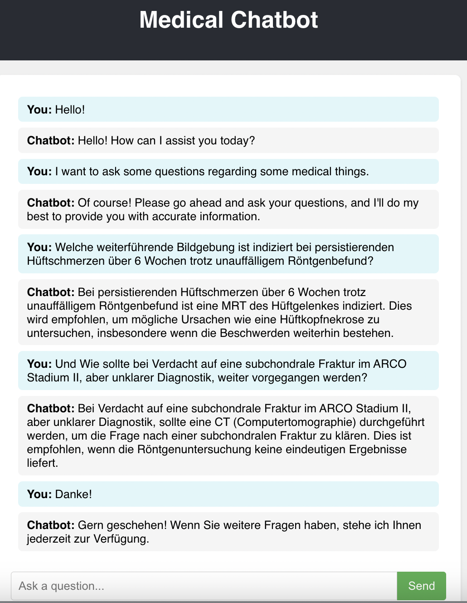

# Medical Analysis RAG Chatbot
This document outlines the setup and usage of a Retrieval-Augmented Generation (RAG) chatbot. This chatbot is designed to answer medical questions in any language, extracting information from a corpus of German medical documents to provide answers based on user-described problems and diagnoses.

## Prerequisites

* Python 3.10+
* pip (Python package installer)
* Node.js and npm (Node Package Manager)
* API keys for Hugging Face and OpenAI

## Setup

### 1. Environment Variables

* Create a `.env` file in the **root directory** of the project with the following API keys:

    ```bash
    HUGGINGFACE_KEY=<YOUR_HUGGINGFACE_API_KEY>
    OPENAI_KEY=<YOUR_OPENAI_API_KEY>
    VECTOR_DB_PATH='backend/app/vector_store'
    ```
**Note:** Replace the placeholder values with your actual API keys obtained from the respective platforms.

### 2. Backend Setup

* Create and Activate Virtual Environment

    ```bash
    python3 -m venv Ragchatbot_Env # Create a virtual environment
    source Ragchatbot_Env/bin/activate  # Linux/macOS
    ```

* Install Dependencies

    ```bash
    pip install -r backend/requirements.txt
    ```

* 2.3. Create Embedding Database

    ```bash
    python3 -m backend.app.modules.document_retrieval.embedding_and_storage
    ```

* Run Backend Server: Navigate to the `backend` directory:

    ```bash
    cd backend
    ```

* Start the Uvicorn server:

    ```bash
    uvicorn backend.app.main:app --reload --host 0.0.0.0 --port 8000
    ```

This will start the backend server on localhost:8000, and you should see output indicating that the server is running.

### 3. Frontend Setup

* 3.1. Install Node.js Packages<br>
    Navigate to the `frontend` directory:

    ```bash
    cd frontend
    ```

* Install dependencies:

    ```bash
    npm install
    ```

* Run Frontend Server

    ```bash
    npm run start
    ```

This will typically open the frontend in your browser at `http://localhost:3000.`


* Ask medical questions in any language through the chatbot interface on http://localhost:3000. The chatbot will retrieve relevant information and generate an answer.

## Project Structure
```bash
├── backend/
│   ├── app/
│   │   ├── documents/
│   │   ├── modules/
│   │   │   ├── chatbot_logic/
│   │   │   │   └── __init__.py
│   │   │   ├── document_preprocessing/
│   │   │   │   └── __init__.py
│   │   │   ├── document_retrieval/
│   │   │   │   └── __init__.py
│   │   │   └── __init__.py
│   │   ├── router/
│   │   │   └── __init__.py
│   │   ├── vector_storage/
│   │   ├── config.py
│   │   ├── main.py
│   │   └── __init__.py
│   ├── pyenv
│   └── requirements.txt
├── frontend/
│   ├── node_modules/
│   ├── public/
│   ├── package.json
│   ├── README.md
│   └── src/
│       ├── App.js
│       └── Chatbot.js
├── .env
├── .gitignore
└── README.md
```

The backend is created using FastAPI, and the frontend is built with React. The project is structured to separate concerns, with modules for document retrieval, preprocessing, and chatbot logic.

## Explanation of Key Components (#TODO)


## Testing Using Jupyter Notebook
A Jupyter Notebook (`Extra/rag_test.ipynb`) is included for comprehensive testing of the chatbot's core functionalities. This notebook demonstrates:

* **Document Retrieval Evaluation:** It contains a series of queries designed to assess the effectiveness of the document retrieval component. For each question, the notebook retrieves the top three most relevant document chunks and evaluates their relevance based on precision and recall scores. The results of this evaluation are stored in `Extra/rag_test_document_retrieval.csv`.

* **Chatbot Logic Evaluation:** The notebook further tests how the chatbot model utilizes the retrieved document chunks to generate precise and contextually accurate answers to user questions. It evaluates the quality of the final responses, demonstrating the RAG process in action and the model's ability to refine answers based on the retrieved information. The evaluation metrics for the chatbot's responses are recorded in `Extra/rag_test_chatbot_logic.csv`.

By examining these notebooks and their corresponding CSV outputs, you can gain insights into the performance of both the document retrieval and the chatbot's response generation capabilities.


## Chatbot Example
<div style="text-align: center;">
    
</div>